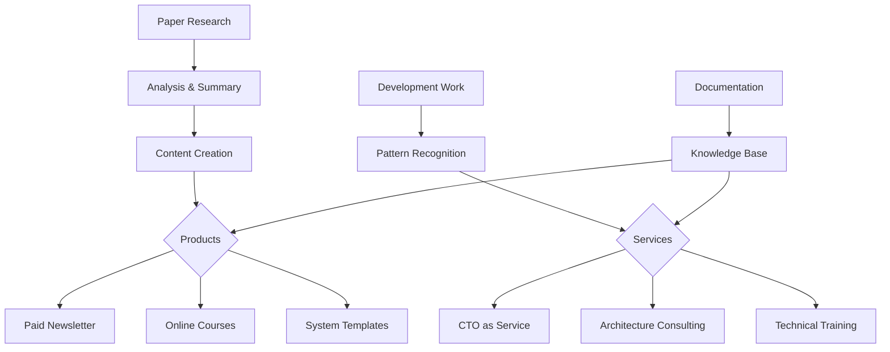

# todo
[x ] paper group 
[ ] OpenHands project prompts in .openhands_instructions
[ ] swagger.yaml -> markdown github action
[/ ] server setup
[ ] workflows for gumloop or kestra
[/ ] cleanup github forked repos
[/ ] evelynmitchell/async_python_testing_tutorial - get asynchronous tests running
[ ] evelynmitchell/TemplateUpdateRepos
[ ] setup
[ ] deploy to GCP as well as AWS
[ ] aap https://agentlaboratory.github.io/ and https://arxiv.org/pdf/2409.12516 A Multi-agent Market Model Can Explain the Impact of AI Traders in Financial Markets – A New Microfoundations of GARCH model
[ ] docs on creating SEAL https://github.com/evelynmitchell/SEAL-js
[ ] write agents for https://github.com/evelynmitchell/AgentHands |
[ ] open ticket to test swarms with https://github.com/TheAgentCompany/TheAgentCompany

# team call
Harshell's ui looks good
explained noqa


Taught gilbert about copilot in github

Met Barrett

Chatted with Roger about teaching Claude how to coach me.

# done

[x] paper group
https://arxiv.org/abs/2501.05441 The GAN is dead; long live the GAN! A Modern GAN Baseline; https://github.com/brownvc/R3GAN New implementation of Generative Adversarial Networks eliminates ad hoc tricks in favor of a principled loss function.
https://arxiv.org/abs/2501.05453 An Empirical Study of Autoregressive Pre-training from Videos ; https://brjathu.github.io/toto/ patch learning in videos
https://arxiv.org/abs/2501.04003 Are VLMs Ready for Autonomous Driving? An Empirical Study from the Reliability, Data, and Metric Perspectives ; https://drive-bench.github.io/ [Evals] talking to drive
https://arxiv.org/abs/2501.04377 On Computational Limits and Provably Efficient Criteria of Visual Autoregressive Models: A Fine-Grained Complexity Analysis
https://arxiv.org/abs/2501.03489 Entropy-Guided Attention for Private LLMs ; 
https://arxiv.org/abs/2501.05032 Enhancing Human-Like Responses in Large Language Models "This paper explores the advancements in making large language models (LLMs) more human-like. We focus on techniques that enhance natural language understanding, conversational coherence, and emotional intelligence in AI systems. The study evaluates various approaches, including fine-tuning with diverse datasets, incorporating psychological principles, and designing models that better mimic human reasoning patterns. Our findings demonstrate that these enhancements not only improve user
interactions but also open new possibilities for AI applications across different domains. Future work will address the ethical implications and potential biases introduced by these human-like attributes." https://huggingface.co/datasets/HumanLLMs/Human-Like-DPO-Dataset
https://arxiv.org/abs/2501.05040 SWE-Fixer: Training Open-Source LLMs for Effective and Efficient GitHub Issue Resolution ; mentions https://github.com/OpenAutoCoder/Agentless this paper has a simpler, RAG based agent strategy.
https://arxiv.org/abs/2501.05450 Decentralized Diffusion Models ; https://decentralizeddiffusion.github.io/ 
https://openreview.net/pdf?id=r8J3DSD5kF Stick-breaking Attention ; recency-bias incorporating alternative to softmax

https://arxiv.org/abs/2501.04519 rStar-Math: Small LLMs Can Master Math Reasoning with Self-Evolved Deep Thinking ; lots of excitement around this paper. Phi-4 model

## async python testing tutorial
pip install pytest pytest-asyncio
```
$ python3.12 -m venv "asynctut"
$ source asynctut/bin/activate
```
[x]Got synchronous tests running


clean up repos 928

# daily work review
```
Core Activities I See:

1. Technical research and paper reviews (particularly in AI/ML)
2. Project management and development work
3. Writing and documentation
4. Team collaboration/meetings
5. System architecture and design work
```

```
Here are my suggestions for potential business opportunities and tracking:

1. Research-Based Opportunities:

- Create a paid newsletter/subscription service summarizing AI papers and their practical implications
- Develop training courses based on your paper analysis (e.g., "Practical GAN Implementation" based on your R3GAN paper review)
- Consulting services for companies wanting to implement latest AI research
- Technical writing services for AI companies

Metrics to Track:

- Number of papers reviewed per week
- Time spent per paper analysis
- Topics covered/categorization
- Implementation attempts/success rate
- Reader engagement (if publishing summaries)
```

```
2. Development & Architecture:

- Create a "CTO-as-a-Service" offering based on your "CTO on a shoestring" knowledge
- Develop productized consulting for system architecture (your system design knowledge)
- Create templates and starter kits for common development patterns

Metrics to Track:

- Project completion rate
- Time spent per project type
- Common bottlenecks
- Client pain points
- Reusable components created
```

```
3. Documentation & Writing:

- Technical documentation service
- Training material development
- System design templates marketplace
- Architecture decision record templates

Metrics to Track:

- Words written per day
- Documentation types
- Time spent per documentation type
- Reader feedback/usage statistics
```


```
Additional Recommendations:

1. Implement interstitial journaling (mentioned in your notes) to better track time usage
2. Use the Plus-Minus-Next framework for weekly reviews
3. Implement the Weekly Business Review (WBR) system you're exploring
4. Create a structured template for paper reviews that can be easily converted into content
```

Static markdown blog site: mkdocs, gitbook, mdbook

[[Paper Review Template]]
```
**Structured for Multiple Outputs**: The template is organized so you can easily:

- Generate newsletter content from the Executive Summary and Business Impact sections
- Create tutorial content from the Implementation Considerations and Reference Implementation
- Build consulting materials from the Practical Applications section
```

# links

## CTO on a shoestring
https://www.nhatcher.com/post/a-cto-on-a-shoestring/
https://www.cloudron.io/
https://github.com/Dokploy/dokploy
## networking
https://nats.io/ NATS is a simple, secure and high performance open source data layer for cloud native applications, IoT messaging, and microservices architectures.

## Product Manager onboarding/job description
[The Lindy PM Standard of Performance](https://docs.google.com/document/d/1jZnuTXUlpwCSg6n24qSBuCNvaHbj025EDnpGwEp98As/edit?tab=t.0#heading=h.vdvto0d9i83x)

## category theory
https://www.logicmatters.net/categories/


# agent ideas
Agent framework architecture; https://x.com/charlespacker/status/1877398183938240530
```
guys agent frameworks are so stupid, all you need is an anthropic API key and a while loop …and a FastAPI server so that we can use the agents programmatically …and some good API designs to enable multi user and multi agent support …and a tool execution sandbox so that the agent tools don’t interfere with the main server process …and a real database so that the agents are actually persisted and don’t disappear when the script finishes …and an ORM so that we can properly scale the agent server …and some extra middleware code since we also want to use local LLMs but they have less reliable function calling …and some sort of file storage / embedding solution to do RAG …and some sort of context management system to handle the long term memory problem and deal with context overflow … …congratulations, you just built an “agents framework”
```

Google’s Gemini with Deep Research a specialized research agent . Example of work: "research a comparison of ways of funding startup companies, from the perspective of founders, for high growth ventures" (https://docs.google.com/document/d/1JiTwIQaCL71_jMDActcjDhtlOy0cnXHGYKqMHUlMMD4/edit?tab=t.0) 

https://jina.ai/

## how to think in writing
https://www.henrikkarlsson.xyz/p/writing-to-think
“make a conjecture,” a qualified guess based on limited information. ... But being right wasn’t the point: getting a better understanding was
“interrogating the conclusion to come up with an explanation of why it _could_ be true.” Unpack the conclusion into all the premises. Consider/attack each one.
This way of formulating it (“Not _that_”) is a bit vague as it only defines where not to look for the solution. It is useful to also attempt a positive formulation.
These days, I would instead stretch a conclusion like this as a series of bullet points where I spell out the intuition behind my claim in a series of premises.
Once I stretch my understanding thin in writing, I often see holes right away. I start correcting myself and discarding ideas already while typing. I cut ideas that are obviously flawed. I rewrite what feels ambiguous to make it sharper–more precise, concrete, unhedged, and true to my understanding.
But in my experience, it is these subtler problems that tend to open a path beyond my current understanding.
I’m trying not to kill ideas. I want to help them evolve and spill forth more insight.

## tools for thinking
https://untools.co/
templates
```
- Abstraction Laddering (PDF only)
- Connection Circles (PDF only)
- Eisenhower Matrix (PDF + Notion)
- Decision Matrix (PDF + Notion)
- Iceberg Model (PDF + Notion)
- Impact-Effort Matrix (PDF only)
- Ladder of Inference (PDF + Notion)
- Second-order Thinking (PDF + Notion)
- Conflict Resolution Diagram (PDF + Notion)
- Situation-Behavior-Impact (PDF only)
```
```
- Eisenhower Matrix - Prioritize your actions and tasks by importance and urgency
- Second-order Thinking - Consider the long-term consequences of your decisions.
- Abstraction Laddering - Frame your problem better with different levels of abstraction. "- Start with an initial problem statement in the middle of the ladder.
- Ask "why" questions to get more abstract problem statements. This can help you frame the problem differently.
- Ask "how" questions to step toward a more concrete statement or solution. This helps you come up with different problem statements than the one you started with. It enables you to find more innovative solutions.""
- Decision Matrix - Choose the best option by considering multiple factors.
- Ladder of Inference - Avoid jumping to conclusions. Make decisions based on reality. "1. Available data
    - This is the reality we are able to observe.
2. Selected data
    - We select what we pay attention to based on our prior experiences and existing beliefs. We don't have the mental capacity to take in every piece of data available, so we have to make this selection.
3. Interpretations
    - We give facts meaning. We paraphrase what we see or hear to make sense of it.
4. Assumptions
    - Based on our interpretation, we make our own personal assumptions.
5. Conclusions
    - We draw conclusions from our assumptions.
6. Beliefs
    - Our beliefs are then developed from the conclusions we make.
7. Actions
    - Finally, we take actions that are rooted in what we believe to be true.""
- Iceberg Model - Uncover root causes of events by looking at hidden levels of abstractions.
- Impact-Effort Matrix - Prioritize by weighing impact against the effort required.
- Conflict Resolution Diagram - Find win-win solutions to conflicts "- Demands/proposals of the opposing sides: these are usually mutually exclusive which is what creates the conflict.
- Underlying needs or requirements of both sides
- Shared goal or objective that's behind the needs "
- Connection Circles - Understand relationships and identify feedback loops within systems. - Connection circles can also help you identify feedback loops – whether [reinforcing](https://untools.co/reinforcing-feedback-loop/) or [balancing](https://untools.co/balancing-feedback-loop/).
- Situation-Behavior-Impact - Give clearer feedback to others without judgement.
```
### Interstitial journaling
https://nesslabs.com/interstitial-journaling
"The basic idea of interstitial journaling is to write a few lines every time you take a break, and to track the exact time you are taking these notes. For instance:

**10:04** - Going to finish the first draft of the mindful productivity article.
**10:46** - I fell into a Twitter blackhole again! Back to work.
**11:45** - Made good progress. Need to get ready for meeting with Charlie.
**11:49** - Reviewed agenda and docs. Feeling a bit anxious, but I think it will go fine. Need to call Anna after the meeting to debrief.

Notice the mix of goals (“finish the first draft”), self-awareness (“fell into a Twitter blackhole”, “feeling anxious”), self-review (“good progress”), and actionable items (“call Anna”)?"

### plus minus next
https://nesslabs.com/plus-minus-next
Three columns 
write “+” for what worked, “–” for what didn’t go so well, and “→” for what you plan to do next.

### alphas
```
Things that are/may be alphas: - Exchange time differences - Holidays - Economic/calendar/corporate events - Price-insensitive rebalancing - Grifting Things that are not alphas: - Fancy indicators - Extra long beta - "Vibes" - Hope - Macro views (specifically mine and yours)
```
## Weekly Business Review
https://workingbackwards.com/input-metrics-mastery/
- **Lesson 1: Introduction to the Course**  
    Get an overview of what input metrics are, why they matter, and how this course will transform your approach to managing and growing your business.
- **Lesson 2: DMAIC**  
    Discover the power of the DMAIC (Define, Measure, Analyze, Improve, Control) framework in refining input metrics and achieving consistent operational improvements.
- **Lesson 3: Amazon Case Study**  
    Learn from Amazon’s journey with input metrics, understanding how they shifted from output-focused goals to a precise, input-driven process, achieving scalable success.
- **Lesson 4: Discovering Your Input Metrics**  
    Identify the core input metrics for your unique business model, using practical techniques to uncover what truly drives your success.
- **Lesson 5: Measure**  
    Master the measurement phase to accurately capture input data, laying the groundwork for informed, effective decisions that propel your growth.
- **Lesson 6: WBR Overview**  
    Get introduced to the Weekly Business Review (WBR) process, a structured framework for reviewing metrics that keep you proactive rather than reactive.
- **Lesson 7: WBR Report**  
    Learn the step-by-step process for creating effective WBR reports, focusing on the right metrics to inform data-driven actions and decisions.
- **Lesson 8: WBR Meeting**  
    Explore how to conduct a successful WBR meeting, designed to foster a collaborative environment that keeps teams aligned and accountable.
- **Lesson 9: WBR App Introduction**  
    Gain insights into using the free, open-source Weekly Business Review App. Discover how to deploy it within your organization for streamlined data processing, report generation, and visualization of key metrics. (https://github.com/working-backwards/wbr-app)
https://github.com/working-backwards/wbr-app/
```bash
$ git clone https://github.com/working-backwards/wbr-app.git
$ cd wbr-app
$ python3.12 -m venv "venv"
$ source venv/bin/activate
$ pip install -r requirements.txt
$ waitress-serve --port=5001 --call src.controller:start
```
Open http://localhost:5001/wbr.html

https://app.workingbackwards.com/docs/index.html

https://github.com/evelynmitchell/wbr-ai-yaml-generator

## Learning by writing
https://www.cold-takes.com/learning-by-writing/
```
|   |   |
|---|---|
|Step 1|Pick a topic|
|Step 2|Read and/or discuss with others (a bit)|
|Step 3|Explain and defend my current, incredibly premature hypothesis, in writing (or conversation)|
|Step 4|Find and list weaknesses in my case|
|Step 5|Pick a subquestion and do more reading/discussing|
|Step 6|Revise my claim / switch sides|
|Step 7|Repeat steps 3-6 a bunch|
|Step 8|Get feedback on a draft from others, and use this to keep repeating steps 3-6|
```
Step 3 is crucial "I try to **continually focus my reading on the goal of forming a bottom-line view, rather than just “gathering information.”** "I consider this approach to be **probably the single biggest difference-maker between "reading a ton about lots of things, but retaining little" and "efficiently developing a set of views on key topics and retaining the reasoning behind them."**"

## System design
https://www.dropbox.com/scl/fi/3v72ae1lbpo3skqvl5alq/Learn-System-Design-in-a-Hurry.pdf?rlkey=9ke2ykmc7qcwxfgs8ok1shwoa&e=1&st=ijbf0llq&dl=0
Interview prep

## UI simplifier
https://www.amran.cz/how-ai-can-make-software-more-intuitive/
What is the hardest part of your UI and how can you use an LLM to help your customers get around that?