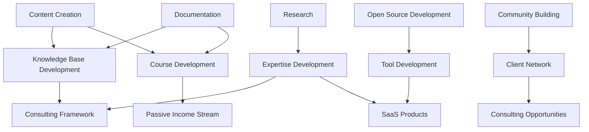

# todo
[ ] paper group 
[x ] github notifications
[x ] github dashboard
[ ] OpenHands project prompts in .openhands_instructions
[ ] swagger.yaml -> markdown github action
[/ ] server setup
[ ] workflows for gumloop or kestra
[/ ] cleanup github forked repos
[/ ] evelynmitchell/async_python_testing_tutorial - get asynchronous tests running
[ ] evelynmitchell/TemplateUpdateRepos
[ ] aap https://agentlaboratory.github.io/ and https://arxiv.org/pdf/2409.12516 A Multi-agent Market Model Can Explain the Impact of AI Traders in Financial Markets – A New Microfoundations of GARCH model
[ ] docs on creating SEAL https://github.com/evelynmitchell/SEAL-js
[ ] write agents for https://github.com/evelynmitchell/AgentHands |
[ ] open ticket to test swarms with https://github.com/TheAgentCompany/TheAgentCompany
[ ] Weekly Business Review - yaml (hypothesis, dag, metrics)
[x ] modern GAN () - could work more on readme
[ ] https://github.com/evelynmitchell/sophie
[ ] https://github.com/evelynmitchell/bootstrapFlywheel

# done
[x ] github notifications
[ x] update PythonProjectTemplate with ruff version
[ x] modern GAN (12:17-12:41l 17:00-19:16) ; dependabot ruff; linting, colab notebook, docs ready to release
[x ] github dashboard
[/ ] cleanup github forked repos

# Links

https://paperswithcode.com/dataset/ifeval Instruction following eval
https://github.com/google-research/google-research/tree/master/instruction_following_eval

torch scaled_mm_api notes https://gist.github.com/drisspg/783616821043ab4594b9784f556c6714

Knowledge distillation: https://en.wikipedia.org/wiki/Knowledge_distillation

Monte Carlo Tree Search https://www.geeksforgeeks.org/ml-monte-carlo-tree-search-mcts/

Ranking loss https://gombru.github.io/2019/04/03/ranking_loss/

rStar-Math https://arxiv.org/pdf/2501.04519

StyleGan2 https://github.com/NVlabs/stylegan2-ada-pytorch
GAN https://github.com/brownvc/r3gan
https://arxiv.org/pdf/2501.05441

LaTeX in WASM https://www.swiftlatex.com/#demo

# models

phi-4 https://huggingface.co/collections/microsoft/phi-4-677e9380e514feb5577a40e4
https://techcommunity.microsoft.com/blog/aiplatformblog/introducing-phi-4-microsoft%E2%80%99s-newest-small-language-model-specializing-in-comple/4357090

# daily work review with claude
Based on your daily activities and projects, I'll help analyze potential business opportunities and suggest a framework for tracking and optimization. Let me break this down systematically:

Current Activities Analysis:
1. Technical Development (modern-gan, Python testing, agents)
2. Community Engagement (PyCoffee meetings, paper groups)
3. Documentation/Technical Writing (swagger.yaml to markdown)
4. Project Management (GitHub notifications, dashboard management)
5. Research (AI papers, financial markets modeling)

Potential Business Opportunities:

1. AI Development Consulting
- What you're already doing: Working with GANs, agents, and AI models
- Business extension: 
  - Offer specialized consulting for companies implementing AI systems
  - Create training materials based on your project experiences
  - Metrics to track: Client inquiries, consulting hours, project completion rates
  - Additional tracking needed: Time spent per project type, client pain points

2. Technical Education Platform
- Building from: Your Python testing tutorials and documentation work
- Business model:
  - Create premium course content around async Python, AI implementation
  - Membership site for advanced technical tutorials
  - Metrics: Course completion rates, subscriber retention, content creation velocity
  - Additional tracking: Topic popularity, student questions, completion difficulties

3. AI Tools as a Service
- Based on: Your agent development work (AgentHands, SEAL-js)
- Business potential:
  - Productize your agent frameworks
  - Offer hosted solutions for AI agent deployment
  - Metrics: API usage, customer adoption rate, service uptime
  - Additional tracking: Most used features, performance bottlenecks

Let me create a directed graph of recommended activities:

Key Metrics to Track:

1. Development Metrics
- Time spent per project category
- Project completion rate
- Code reuse across projects
- Documentation coverage

2. Community Metrics
- Network growth rate
- Engagement in technical communities
- Speaking/presentation opportunities
- GitHub repository stars/forks

3. Business Development Metrics
- Revenue per activity type
- Time to value for new initiatives
- Customer acquisition cost
- Customer lifetime value
- Content creation efficiency

Recommended Next Steps:
1. Create a structured logging system for your daily activities with categorization
2. Set up analytics for your GitHub repositories to track engagement
3. Start documenting your technical processes in a format suitable for teaching
4. Identify which of your current projects could be productized first

Would you like me to elaborate on any of these aspects or help you set up a specific tracking system?

