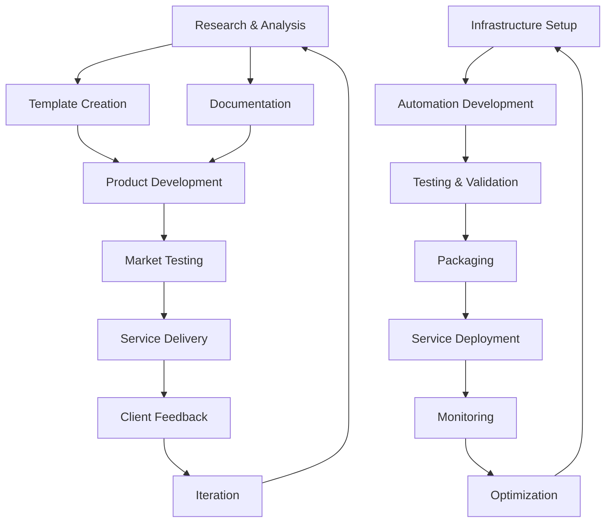

# todo
[x ] paper group (09:00-10:00)
[  x] github notifications
[ x ] github dashboard
[ ] OpenHands project prompts in .openhands_instructions
[ ] swagger.yaml -> markdown github action
[/ ] server setup
[ ] workflows for gumloop or kestra
[/ ] cleanup github forked repos
[/ ] evelynmitchell/async_python_testing_tutorial - get asynchronous tests running
[ ] evelynmitchell/TemplateUpdateRepos
[ ] aap https://agentlaboratory.github.io/ and https://arxiv.org/pdf/2409.12516 A Multi-agent Market Model Can Explain the Impact of AI Traders in Financial Markets – A New Microfoundations of GARCH model
[ ] docs on creating SEAL https://github.com/evelynmitchell/SEAL-js
[ ] write agents for https://github.com/evelynmitchell/AgentHands |
[ ] open ticket to test swarms with https://github.com/TheAgentCompany/TheAgentCompany
[ ] Weekly Business Review - yaml (hypothesis, dag, metrics)
[x ] modern GAN () - could work more on readme, inference, data gen, training tools
[ ] https://github.com/evelynmitchell/sophie
[ ] https://github.com/evelynmitchell/bootstrapFlywheel
[ ] set up multiagent debate training setup with phi4/ollama

# done

[ x ] github notifications
[x  ] github dashboard
[ x] dependabot bootstrapFlywheel
[ x] dependabot tinyTimeMixers
[x] filing
[ x] paper group
https://llm-multiagent-ft.github.io/ 
https://arxiv.org/abs/2501.05707
This is a very good paper with a simple setup, which demonstrated a way to fine tune a generation set of small models and a critic set of small models to be good at a diverse set of tasks. The models were small and old, and the tasks also small and old. Excited to try this on harder problems and with newer open source small models. Excited to do an LLM-as-a-judge pass on the critics, and an rStar pass on the data generation. 
The summary stage, majority voting, and positive/negative pair weighting all helpful.
The debate didn't require more than a majority vote, so tree-of-thoughts or graph-of-thoughts or rStar may all improve this significantly.
Could also use multiple LLMs to increase diversity of skills learned, with a size/accuracy RL reward over distinct skills
One thing I would add would be categorizing the inputs by similarity, and check whether diversity of inputs helps or hinders diversity of fine tuning of generative/critic models
[x ] modern GAN () - could work more on readme, inference, data gen, training tools

# links

GPU over IP https://github.com/kevmo314/scuda SCUDA is a GPU over IP bridge allowing GPUs on remote machines to be attached to CPU-only machines.
Includes a good variety of CUDA examples: https://github.com/NVIDIA/cuda-sample

Fast log searchL https://quickwit.io/ https://github.com/quickwit-oss/quickwit Cloud-native search engine for observability. An open-source alternative to Datadog, Elasticsearch, Loki, and Tempo.

astro.build  content websites nodr

Lunar vacuum metallurgy https://www.youtube.com/watch?v=xH4Ki6TxRTs

```
OP 5 Time Series Forecasting Libraries in 2025  
  
(with Pros and GitHub Stars)  
  
🟢 ð—¡ð—¶ð˜…ð˜ð—¹ð—® ð—¦ð—²ð˜ ð—¼ð—³ ð—Ÿð—¶ð—¯ð—¿ð—®ð—¿ð—¶ð—²ð˜€ - ðŸ­ðŸ®ð—¸ â­  
Nixtla is a set of state-of-the-art time series forecasting methods that are embedded in a set of libraries and models, most famous are:  
-> statsforecast  
-> neuralforecast  
-> TimeGPT  
  
Today, Nixtla is a go-to environment to solve time series forecasting problems.  
  
🟢 ð——ð—”ð—¥ð—§ð—¦ - ðŸ´ð—¸ â­  
Darts offers a consistent ð˜§ð˜ªð˜µ() and ð˜±ð˜³ð˜¦ð˜¥ð˜ªð˜¤ð˜µ() interface across various forecasting models, from classical methods like ARIMA to deep learning models.  
  
This makes it easy to compare and switch between different models without needing to understand their internal workings  
  
🟢 ð—£ð—¿ð—¼ð—½ð—µð—²ð˜ - ðŸ­ðŸ´.ðŸ°ð—¸ â­  
Prophet is specifically designed for users with limited statistical knowledge, allowing them to easily handle seasonal effects and missing data.  
  
Its intuitive interface makes it accessible for business applications requiring quick and interpretable forecasts.  
  
🟢 ð—¦ð—žð—§ð—¶ð—ºð—² - ðŸ³.ðŸ´ð—¸ â­  
SKtime provides a scikit-learn-compatible framework for time series analysis, enabling users to apply machine learning techniques seamlessly.  
  
This integration allows for easy model tuning, validation, and deployment using familiar tools.  
  
You can also easily use embedded scikit-learn data transformers for feature generation  
  
🟢 ð—šð—¹ð˜‚ð—¼ð—»-ð—§ð—¦ - ðŸ°.ðŸ²ð—¸ â­  
GluonTS is focused on probabilistic forecasting, allowing users to generate not just point forecasts but also confidence intervals.  
  
It can also be easily integrated with Amazon SageMaker, allowing users to scale their training and deployment processes efficiently.  
  
â™»ï¸ Share with network to show your interest in Time Series Modeling!
``` 
(https://www.linkedin.com/posts/timurbikmukhametov_top-5-time-series-forecasting-libraries-in-activity-7284536405949595648-HbLr)

### Accuracy and Speed of Some Short Term Automated Time-Series Forecasting Approaches (Python Packages only) 
https://microprediction.github.io/timeseries-elo-ratings/html_leaderboards/univariate-k_008.html

https://colab.research.google.com/github/microprediction/timemachines/blob/main/examples/notebooks/wiggling.ipynb This takes a very long time to run

# agent ideas

Templates to create model scaffolding: data gen, training, inference, paper writing, docs.
# daily work review

```
I'll analyze your daily activities and suggest potential business opportunities, focusing on what you're already doing. Looking at your work, I see several themes that could be developed into business opportunities:

1. AI/ML Development & Research Focus
Based on your activities around modern-GAN, agent systems, and paper reviews, you seem to have deep expertise in AI systems. Potential business directions:

- AI Model Template Business
  - Turn your scaffolding templates idea (data gen, training, inference, paper writing, docs) into a productized service
  - Metrics to track: Template downloads, time saved per project, customer satisfaction
  - Key activities: Template development, documentation, support

2. Research Analysis & Synthesis
Your paper group activity and detailed analysis shows strong research synthesis abilities:

- AI Research Consulting Service
  - Offer research summaries and implementation guidance for companies
  - Metrics: Client projects, implementation success rate, research coverage
  - Track: Hours spent reading/analyzing, client outcomes

3. Technical Infrastructure
Your work on server setup and workflows suggests infrastructure expertise:

- MLOps Automation Service
  - Package your workflow knowledge (gumloop/kestra) into reproducible solutions
  - Metrics: Deployment time reduction, system reliability, customer base
  - Track: Setup time, maintenance needs, automation coverage

Let me suggest a directed graph of activities you should be doing:

Additional metrics you should track:

1. Research & Development
- Papers reviewed per week
- Implementation attempts/successes
- Time from paper to working code

2. Template Development
- Template completion rate
- User adoption rate
- Time saved per template
- Customer feedback scores

3. Infrastructure
- Server uptime
- Automation success rate
- Deployment time
- Resource utilization

Would you like me to elaborate on any of these areas or suggest specific next steps for one of these business directions?
```

